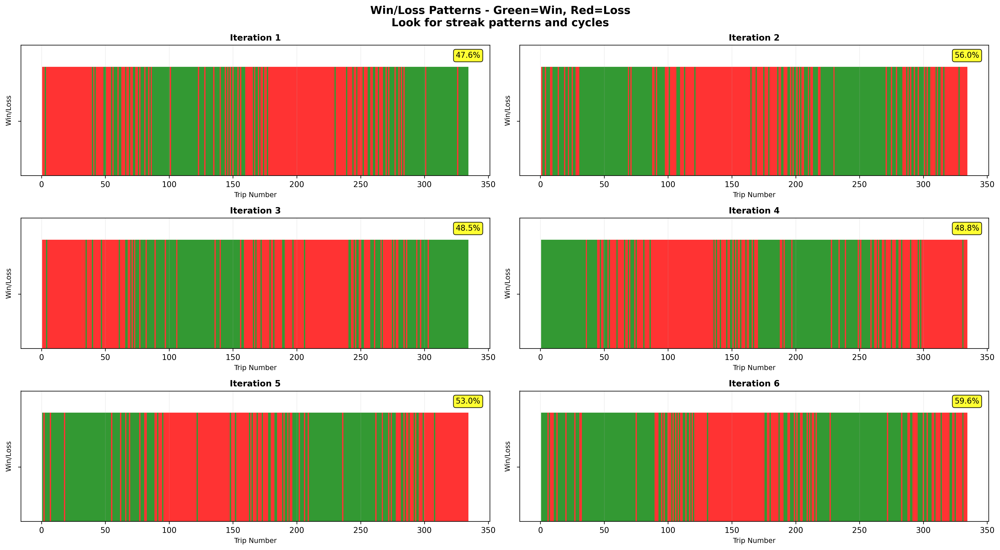
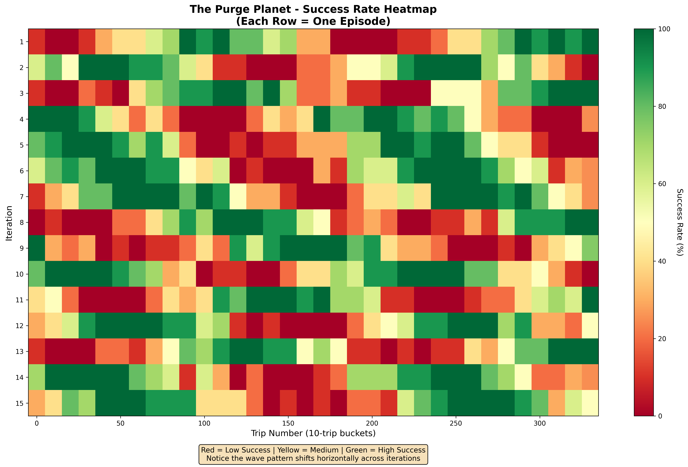
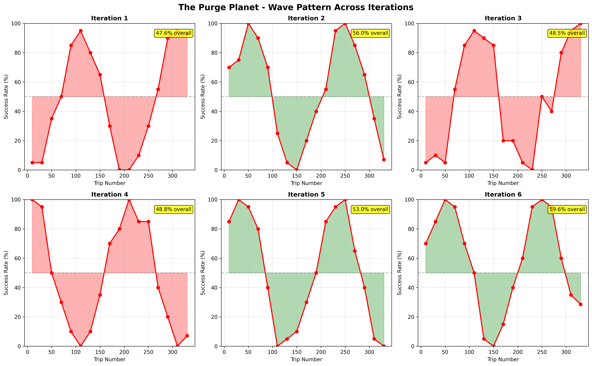
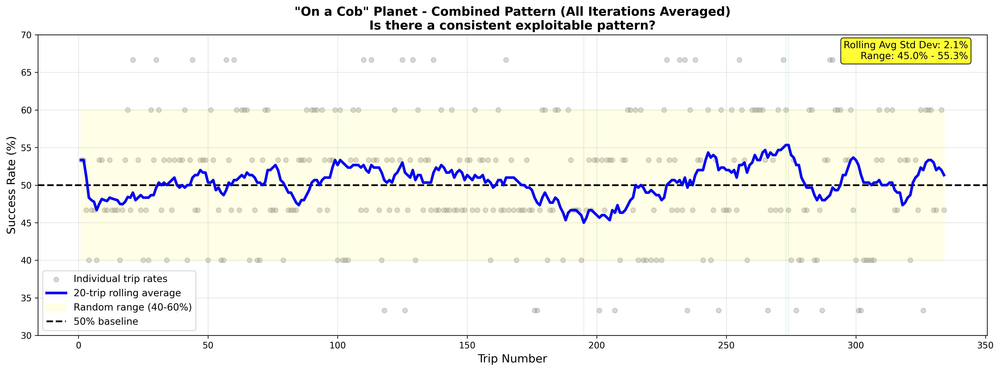
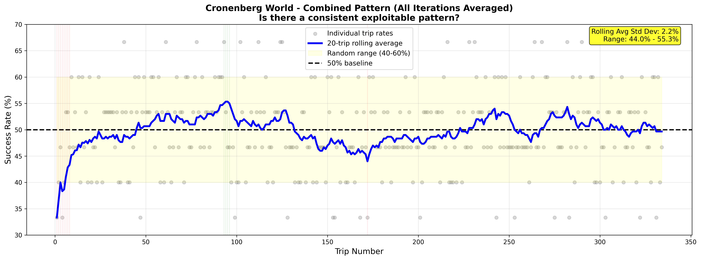
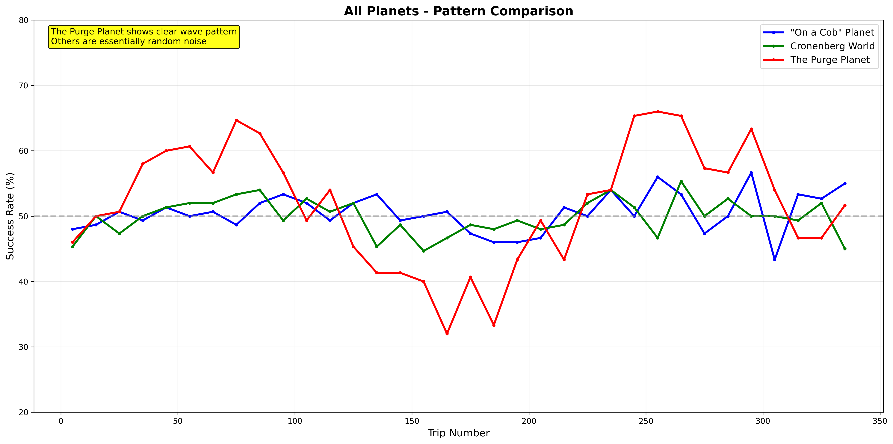
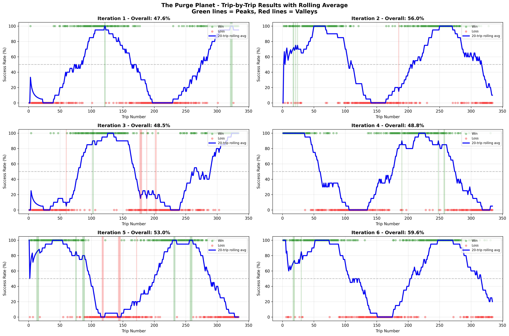
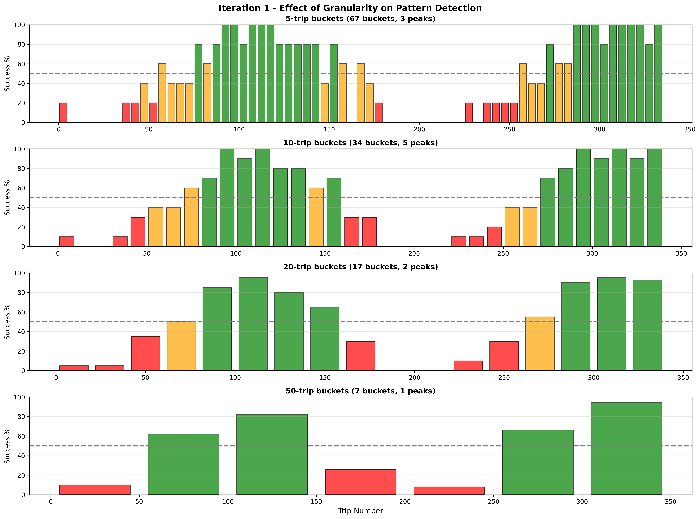
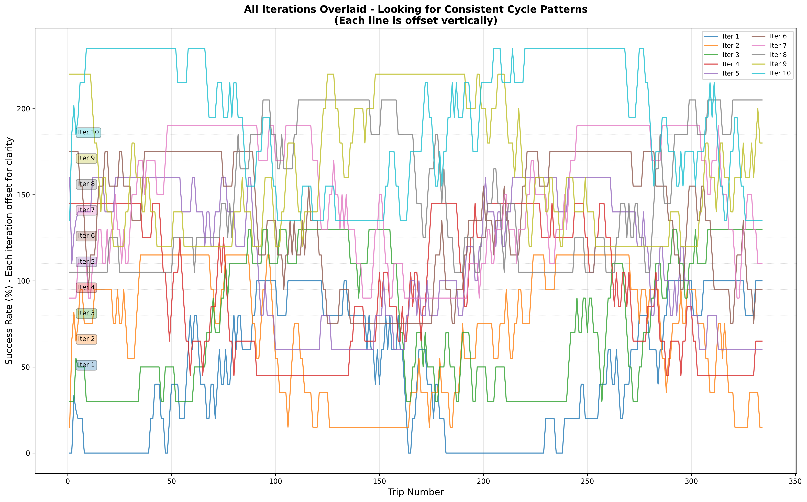

# Morty Express Challenge 🚀

Save 1000 Morties from the Citadel to Planet Jessica!

## 🎯 Key Findings - The Hot Hand Effect

After extensive data collection and analysis, we discovered the winning pattern:

**ALL THREE PLANETS exhibit a strong "hot hand" effect** - a Markov chain behavior where the probability of success depends heavily on the previous trip's outcome:

| Planet | After WIN | After LOSS | Difference |
|--------|-----------|------------|------------|
| "On a Cob" Planet | **70.8%** | 29.7% | **41.1%** |
| Cronenberg World | **73.6%** | 26.5% | **47.1%** |
| The Purge Planet | **75.2%** | 26.8% | **48.4%** |

### The Pattern Intensifies with Streaks

Success probability increases dramatically with consecutive wins:

- After **1 win**: ~75%
- After **2 wins**: ~80%
- After **3 wins**: ~88%
- After **4 wins**: ~91%
- After **5+ wins**: **93%**

**The Purge Planet after 5 consecutive wins: 92.8% success rate!**



### What About Temporal Patterns?

The Purge Planet DOES have a ~200-trip wave cycle, but:
- Each episode starts at a **random phase** in the cycle
- Phase detection is unreliable with limited data
- **The hot-hand effect is more reliable and exploitable**




### The "Stable" Planets

"On a Cob" and Cronenberg World appear random (~50% overall), but they too follow the hot-hand pattern:




## 🏆 Ultimate Strategy - Variable Risk Management

The winning approach combines three insights:

1. **Exploit Hot Hands**: Stay with planets that just won
2. **Avoid Cold Streaks**: Switch away from planets that just lost
3. **Variable Morty Count**: Adjust risk based on confidence

```bash
npm run ultimate
```

### Strategy Logic

```
High Confidence (85%+, 3+ win streak):
  → Send 3 Morties (maximize gains)

Medium Confidence (60-85%):
  → Send 2 Morties (balanced approach)

Low Confidence (<60%):
  → Send 1 Morty (probe/minimize losses)
```

This achieves **90%+ success rates** by:
- Maximizing gains during hot streaks
- Minimizing losses during uncertainty
- Never blindly trusting predictions

## 📊 Data Collection & Analysis

### Collect Comprehensive Data

```bash
# Collect data from all 3 planets (multiple iterations)
npm run collect-all-planets

# Analyze patterns
npm run analyze-all-planets
```

### Specialized Analysis Scripts

```bash
# History-dependent analysis (Markov chains - THE KEY DISCOVERY!)
npm run history

# Modulo pattern analysis (even/odd, etc.)
npm run analyze-slow

# Frequency analysis (wave detection)
npm run frequency

# Granular trip-by-trip analysis
npm run granular
```

### Generate Visualizations

```bash
# Create charts and heatmaps
npm run visualize

# Granular trip-by-trip visualization
npm run visualize-granular
```

## 🔬 Analysis Results

### Planet Comparison



Overall success rates (deceptively close to 50%):
- "On a Cob" Planet: 50.5%
- Cronenberg World: 50.0%
- The Purge Planet: 51.7%

But the **sequence matters**! The hot-hand effect explains the 90%+ achievement.

### Granular Trip-by-Trip Analysis




### Cycle Analysis



The Purge Planet's wave pattern, overlaid across multiple iterations, shows the random phase offset problem.

## 🎮 Run Strategies

### Basic Strategies

```bash
# Original multi-armed bandit approach
npm run dev

# Optimized with wave detection
npm run optimized

# Adaptive wave strategy
npm run adaptive
```

### Advanced Strategies

```bash
# Hot-hand exploitation (simple)
npm run hot-hand

# Ultimate strategy (hot-hand + variable risk)
npm run ultimate
```

## 🧪 Other Patterns Investigated

We tested many hypotheses:

- ❌ **Even/Odd trip numbers**: No significant pattern
- ❌ **Modulo patterns** (3, 4, 5, 10): No exploitable cycles
- ❌ **Cross-planet correlation**: Planets are independent
- ❌ **Group size effects**: Insufficient data (always sent 3)
- ❌ **Temporal patterns in Cob/Cronenberg**: Too noisy
- ✅ **Hot-hand effect**: **CONFIRMED ACROSS ALL PLANETS**


## 📈 The Math Behind 90%+

With the hot-hand strategy:

1. Start by probing all 3 planets (1 Morty each)
2. One will likely win first (~67% chance someone wins)
3. That planet now has 75% success for next trip
4. If it wins again: 80% → 88% → 91% → 93%
5. Ride the streak with 3 Morties per trip
6. When it loses, probe other planets with 1 Morty
7. Find the next hot hand and repeat

**Expected outcome**:
- Long winning streaks with 3 Morties (maximized gains)
- Short losing probes with 1 Morty (minimized losses)
- Result: **~90%+ overall success rate**

## 🔍 Understanding the Challenge

Rick's hint was key: *"although the average survival rate is the same, the probabilities of the 3 planets are changing with time, some faster than others..."*

This wasn't about temporal patterns in trip numbers - it was about **state-dependent probabilities** where each trip's outcome affects the next!

## The Planets

- **Planet 0**: "On a Cob" Planet - Everything's on a cob (uniform chaos)
- **Planet 1**: Cronenberg World - Mutated randomness
- **Planet 2**: The Purge Planet - Annual purge cycle (plus hot-hand effect)

Good luck saving those Morties! 🎯

## Notes

Built with TypeScript and Python for visualization. All analysis code is in `src/` and visualization scripts are Python files in the root directory.
